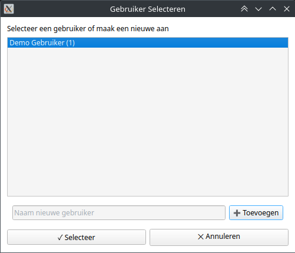
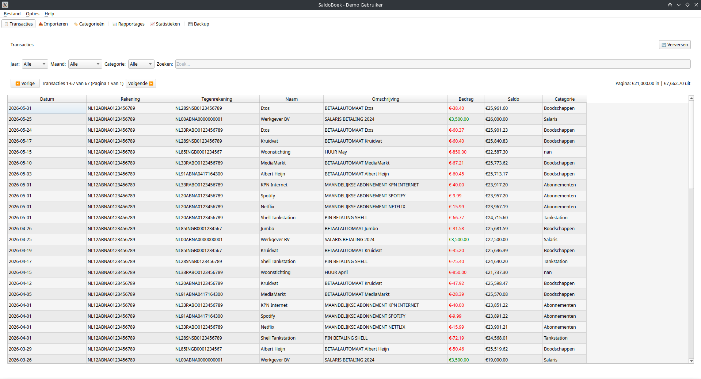
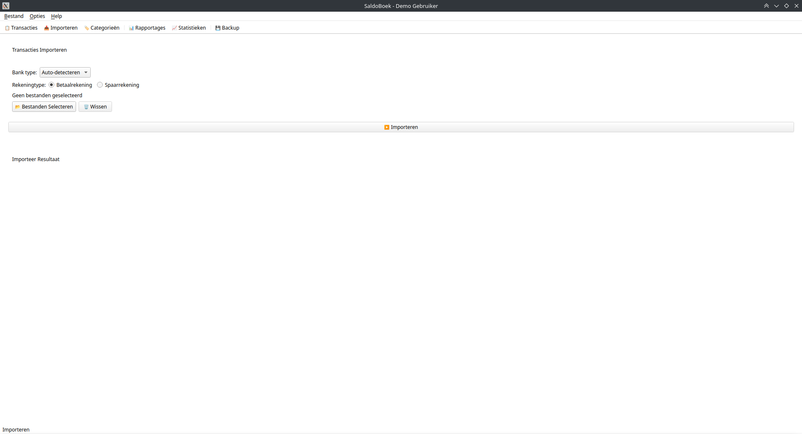
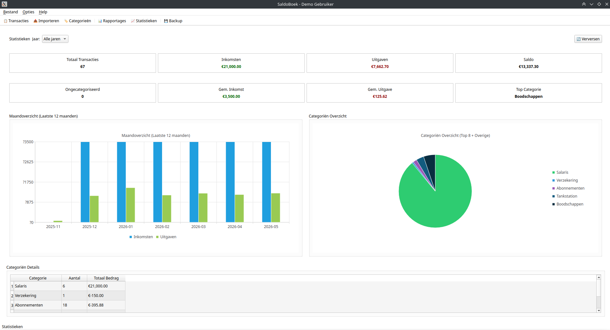
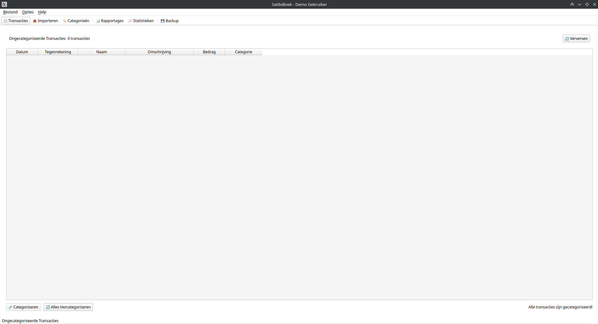
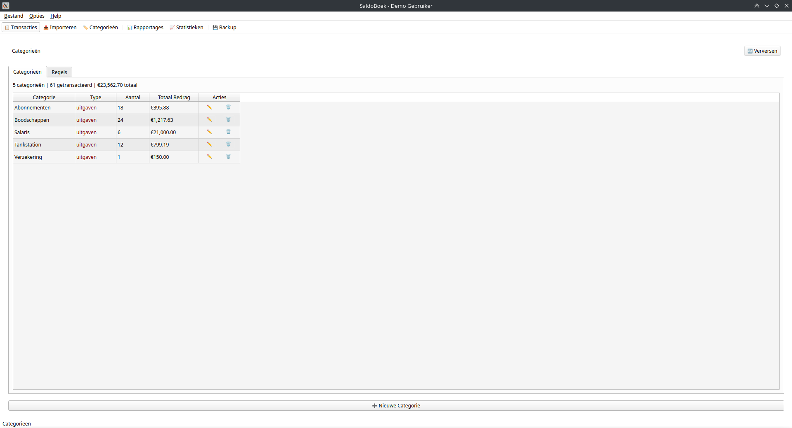
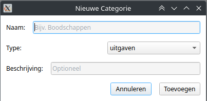
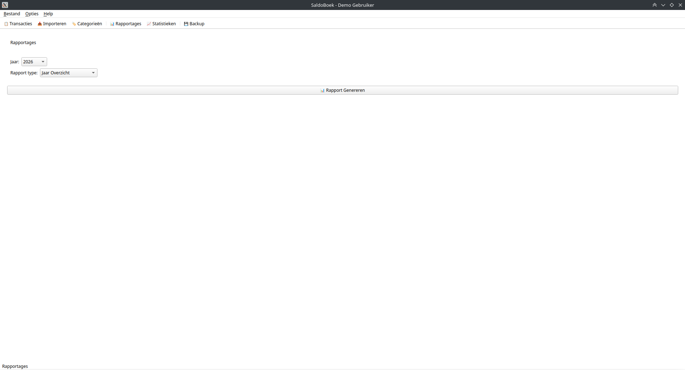

# 💰 SaldoBoek

**Gratis Nederlandstalig financieel beheerprogramma** voor het beheren van persoonlijke financiën, budgetbeheer en het maken van overzichten van je banktransacties.

[](https://opensource.org/licenses/MIT)
[](https://www.python.org/downloads/)
[]()

**SaldoBoek** is ideaal voor persoonlijk budgetbeheer, financiële administratie, bewindvoering, of het maken van jaaroverzichten van al je banktransacties.

---

## 📸 Screenshots

### Gebruiker Selecteren

*Meerdere gebruikers op één installatie*

### Transacties Overzicht

*Overzicht van al je geïmporteerde transacties met zoek- en filterfunctie*

### Import

*Importeer eenvoudig je banktransacties via drag-and-drop*

### Statistieken

*Interactieve grafieken met inkomsten, uitgaven en categorieverdeling*

### Ongecategoriseerde Transacties

*Categoriseer transacties die nog geen categorie hebben*

### Categorieën Beheren

*Beheer je eigen categorieën en categorisatieregels*

### Categorisatie Dialoog

*Wijs een categorie toe en maakregels voor toekomstige herkenning*

### Rapportages

*Exporteer naar Excel voor verdere analyse*

---

## ✨ Features

### Gebruiksvriendelijke GUI
- 🖥️ **Moderne grafische interface** gebouwd met Qt/PySide6
- 🌙 **Donkere en lichte modus** met automatische detectie
- 📊 **Interactieve statistieken** met grafieken en overzichten
- 🔍 **Zoeken en filteren** van transacties
- 📁 **Sleep-en-drop** bestandsselectie

### Bankimport
- 📥 **Importeer banktransacties** van SNS Bank en Rabobank (CSV)
- 🏦 **Ondersteuning voor betaal- en spaarrekeningen**
- 🔄 **Automatische duplicate-detectie** bij import

### Automatische Categorisatie
- 🤖 **Slimme automatische categorisatie** op basis van beschrijving
- 📝 **Maak en beheer je eigen categorieën** (bijv. Boodschappen, Huur, Salaris)
- 📋 **Regelsysteem** voor toekomstige herkenning
- ⚡ **Vergelijkbare transacties** in bulk bijwerken

### Statistieken & Rapportage
- 📈 **Maandoverzicht** met inkomsten/uitgaven grafieken
- 🥧 **Categoriën overzicht** met verdeling
- 📊 **Details per categorie** met aantallen en totalen
- 📁 **Exporteer naar Excel** voor verdere analyse

### Multi-user
- 👥 **Meerdere gebruikers** op één installatie (geen wachtwoord nodig)
- 🏦 **Meerdere rekeningen** per gebruiker
- 👤 **Gebruikersnaam in titelbalk** voor duidelijkheid

---

## 📥 Download

### Windows
Download de nieuwste release voor Windows:
- [SaldoBoek-Windows.zip](https://github.com/tubby1981/SaldoBoek/releases/latest) - Download en unzip, dubbelklik op `start_gui.bat`

### Linux
Download de nieuwste release voor Linux:
- [SaldoBoek-Linux.zip](https://github.com/tubby1981/SaldoBoek/releases/latest) - Download en unzip, run `start_gui.sh`

### macOS
macOS wordt momenteel niet officieel ondersteund. Voor macOS kun je SaldoBoek via Python installeren (zie hieronder).

---

## 🚀 Installeren via Python

SaldoBoek werkt op Windows, Linux en macOS mits Python 3.8+ is geïnstalleerd.

### Stap 1: Clone of download
```bash
git clone https://github.com/tubby1981/SaldoBoek.git
cd SaldoBoek
```

### Stap 2: Maak een virtual environment aan (aanbevolen)
```bash
python3 -m venv .venv

# Linux/macOS:
source .venv/bin/activate

# Windows:
.venv\Scripts\activate
```

### Stap 3: Installeer afhankelijkheden
```bash
pip install -r requirements.txt
```

### Stap 4: Start SaldoBoek
```bash
# GUI modus (aanbevolen)
python -m saldoboek.gui.app

# Of via main.py:
python main.py --gui
```

---

## 🛠️ Configuratie

Bij de eerste start wordt automatisch een database aangemaakt in `saldoboek/data/database.db`.

### Categorieën aanpassen (optioneel)

Bewerk `saldoboek/config/categories.yaml` om standaardcategorieën toe te voegen:

```yaml
uitgaven:
  - naam: "Boodschappen"
    beschrijving: "Supermarkt en winkels"
  - naam: "Huur"
    beschrijving: "Woonkosten"

inkomsten:
  - naam: "Salaris"
    beschrijving: "Maandelijkse loonbetaling"
  - naam: "Bijstand"
    beschrijving: "Uitkering"
```

### Categorisatieregels aanpassen (optioneel)

Bewerk `saldoboek/config/categorization_rules.yaml` om automatische categorisatie in te stellen:

```yaml
"albert heijn": "Boodschappen"
jumbo: "Boodschappen"
"zorgverzekering": "Zorgverzekering"
salaris: "Salaris"
```

---

## 🔄 Updaten naar een nieuwe versie

### Via download (Windows/Linux)
1. Maak een backup van je database: `saldoboek/data/database.db`
2. Download de nieuwe versie
3. Vervang de oude bestanden (bewaar je database!)
4. Start de applicatie opnieuw

### Via Git
```bash
git pull origin main
pip install -r requirements.txt --upgrade
```

Je database blijft behouden bij updates - SaldoBoek voert automatisch migraties uit indien nodig.

---

## 🏦 Ondersteunde Banken

- **SNS Bank** - Transactiehistorie CSV
- **Rabobank** - Transactiehistorie CSV

(Hulp bij het toevoegen van andere banken is welkom!)

---

## 🔍 Keywords

SaldoBoek wordt gevonden onder: persoonlijke financiën, budgetbeheer, financieel beheer, banktransacties importeren, CSV bankafschrift, Nederlandse budget app, gratis boekhoudprogramma, thuisadministratie, bewindvoering hulpmiddel, huishoudboekje digitaal, inkomsten/uitgaven tracker, financiële rapportage Excel

---

## 🏗️ Architectuur

SaldoBoek is opgebouwd in lagen:

```
saldoboek/
├── core/              # Business logic (database, categorisatie, parsers)
├── services/          # Service layer
├── gui/               # PySide6 GUI applicatie
│   ├── views/         # UI schermen
│   ├── viewmodels/    # MVVM ViewModels
│   └── widgets/       # Herbruikbare widgets
└── config/            # YAML configuratiebestanden
```

---

## 📄 Licentie

**MIT License** - Vrij te gebruiken, aan te passen en te verspreiden.

Copyright (c) 2024 SaldoBoek Contributors

---

## 🤝 Bijdragen

Bijdragen zijn welkom! Meld bugs via GitHub Issues of stuur een pull request.

---

**SaldoBoek - Gratis financieel beheer voor iedereen** 💰